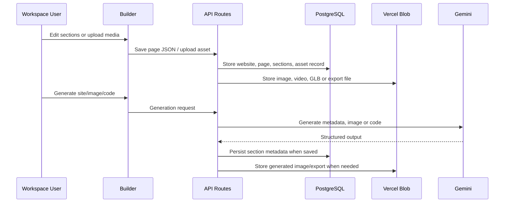
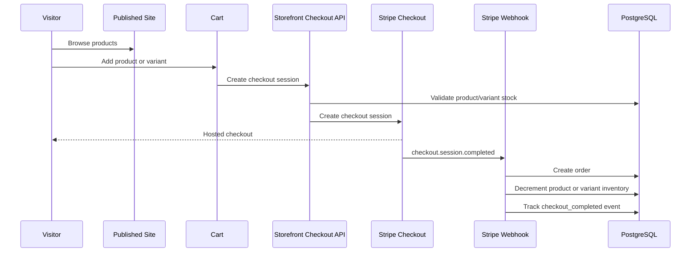
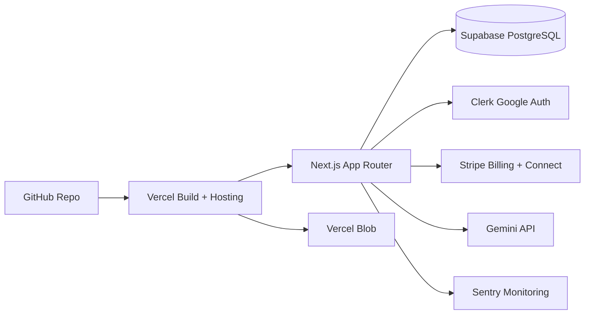

# SaaS Architecture Diagram

This document shows the current architecture for the website builder, storefront, media pipeline, payments, analytics and deployment flow.

## High-level architecture

```mermaid
flowchart TB
  Visitor[Public Visitor] --> PublicSite[Published Site Renderer /s/:slug]
  CustomDomain[Custom Domain] --> Middleware[Host Routing Middleware]
  Middleware --> HostResolver[/host-sites/:host]
  HostResolver --> PublicSite

  User[Workspace User] --> Clerk[Clerk Google Sign-In]
  Clerk --> AppShell[Workspace App Shell]
  AppShell --> Dashboard[Dashboard]
  AppShell --> Builder[Visual Builder]
  AppShell --> CMS[CMS Products Orders Leads]
  AppShell --> SEO[Search Presence]
  AppShell --> Assets[Asset Library]
  AppShell --> Domains[Domain Manager]
  AppShell --> Experiments[A/B Tests]
  AppShell --> Admin[Admin Panel]

  Builder --> PageAPI[Page / Website APIs]
  Builder --> Gemini[Gemini Generation APIs]
  Builder --> Blob[Vercel Blob]
  Assets --> Blob
  Gemini --> Blob

  CMS --> ProductAPI[Product / Variant APIs]
  PublicSite --> Cart[Storefront Cart]
  Cart --> StripeCheckout[Stripe Checkout]
  StripeCheckout --> StripeWebhook[Stripe Webhook]

  Domains --> VercelDomains[Vercel Domains API]
  SEO --> Sitemap[Sitemap / Robots / JSON-LD]
  PublicSite --> Analytics[Analytics Events]
  Experiments --> Analytics

  PageAPI --> Prisma[Prisma ORM]
  ProductAPI --> Prisma
  StripeWebhook --> Prisma
  Analytics --> Prisma
  Domains --> Prisma
  Admin --> Prisma
  Prisma --> Postgres[(Supabase / PostgreSQL)]
```

## Core data flow



## Storefront checkout flow



## Deployment view



## Main modules

| Module | Purpose |
| --- | --- |
| Builder | Metadata-driven visual editing and section persistence |
| Assets | Vercel Blob uploads for images, videos and 3D files |
| Gemini | Website, image, vision and code generation |
| CMS | Products, variants, orders and leads |
| Storefront | Published site renderer, cart, checkout and product pages |
| SEO | Metadata, JSON-LD, sitemap and robots files |
| Domains | Custom domain records, verification and host routing |
| Analytics | Page views, lead events, checkout events and A/B events |
| Admin | Platform counts, audit logs, webhooks and recent records |
| Monitoring | Health endpoint and Sentry-ready instrumentation |
